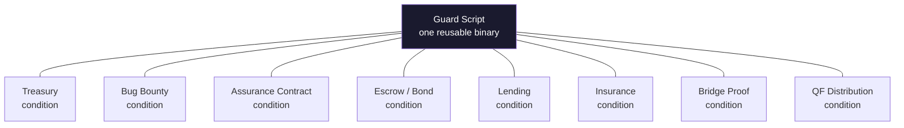

# Possibilities

What the structural authorization pattern could enable on CKB.

This document sketches applications — from near-term buildable to long-range speculative — to show the range of what becomes possible when capacity moves by condition, not by key. Each entry includes the problem, the on-chain mechanism with transaction structures and cell layouts, and an honest assessment of what's needed to build it.

The pattern is specified in [`SPEC-CORE.md`](./SPEC-CORE.md). The treasury (shared pool) application is specified in [`SPEC-TREASURY.md`](./SPEC-TREASURY.md). Everything below is a starting point for builders, not a commitment.

---

## Buildable Now

These use the structural authorization pattern with no major unsolved dependencies. A team with CKB script development experience could build any of these today.

---

### Dominant Assurance Contracts

**Problem:** Public goods are underfunded because of the free rider problem. "I'd contribute if others would too, but I don't want to be the only one paying." Traditional crowdfunding doesn't solve this — contributors risk wasting effort and attention if the threshold isn't met, and the platform takes a fee either way.

The dominant assurance contract (proposed by Alex Tabarrok, 1998) solves the free rider problem by flipping the incentive: an entrepreneur commits to refunding all contributors PLUS a bonus if the project fails. Contributing has positive expected value regardless of outcome — so the rational choice is always to contribute.

Nobody has deployed this at scale. Crowdfunding platforms won't build something that eliminates their fee. A trustless implementation removes the platform.

**Cells:**

```
Assurance pool cell (guarded, open lock):
  type_script: guard_script (authorized_condition = assurance_condition_hash)
  data: version(1) | entrepreneur_lock_hash(20) | target_shannons(8 LE) |
        deadline_since(8 LE) | bonus_shannons(8 LE) | accumulated_shannons(8 LE)

Entrepreneur bonus cell (guarded, open lock):
  type_script: guard_script (authorized_condition = assurance_condition_hash)
  data: version(1) | pool_type_id(32) | bonus_shannons(8 LE)

Contribution receipt cell:
  type_script: assurance_condition_script
  data: version(1) | pool_type_id(32) | contributor_lock_hash(20) | contributed_shannons(8 LE)
```

**Transactions:**

```
Setup (entrepreneur):
  inputs:  [ entrepreneur_wallet ]
  outputs: [ assurance_pool_cell (seed capacity), entrepreneur_bonus_cell (bonus locked) ]

Contribute:
  inputs:  [ pool_cell, contributor_wallet ]
  outputs: [ pool_cell (accumulated += contribution), receipt_cell, contributor_change ]

Success (target reached, anyone triggers):
  inputs:  [ pool_cell, bonus_cell ]
  outputs: [ entrepreneur_payout (pool - target + margin), project_fund (target) ]
  — condition: accumulated >= target

Failure refund (deadline passed, per contributor):
  inputs:  [ pool_cell (since: past deadline), receipt_cell, bonus_cell ]
  outputs: [ pool_cell (accumulated -= contribution),
             contributor_refund (contribution + pro_rata_bonus),
             bonus_cell (reduced) ]
  — condition: accumulated < target AND since past deadline
```

**Condition script logic:**

The assurance condition script has three modes:
1. **CONTRIBUTE:** Verify receipt cell is correctly formed, pool accumulated field is updated, contributor capacity is transferred.
2. **SUCCESS_CLAIM:** Verify `accumulated >= target`. Permit pool drain to project fund and entrepreneur payout. No receipt required — anyone can trigger.
3. **FAILURE_REFUND:** Verify `since` past deadline AND `accumulated < target`. Verify receipt cell consumed matches contributor. Calculate pro-rata bonus share: `(contributed / accumulated) * bonus_shannons`. Verify contributor receives `contributed + bonus_share`.

**What makes this different from a regular crowdfund:** The entrepreneur's bonus cell is locked at setup — they can't withdraw it. If the project fails, the bonus automatically distributes to contributors. This makes the entrepreneur's commitment credible and makes contributing a dominant strategy for rational actors.

**UTXO contention:** Same as crowdfund — contributions are sequential (one per block). For a public goods campaign with moderate interest, this is acceptable. High-volume campaigns need off-chain queuing.

---

### Self-Enforcing Bug Bounties

**Problem:** Bug bounty programs have a credibility gap. A protocol team promises $X for critical vulnerabilities, but:
- The payout depends on the team's severity assessment (subjective)
- The team can dispute, delay, or simply refuse to pay
- Researchers have been publicly stiffed (see: numerous HackerOne disputes)
- The bounty amount can be changed or withdrawn at any time

The result is that top researchers under-invest in auditing, because the expected payout is discounted by the probability of not getting paid.

**Mechanism:** The bounty IS the bug. A guarded cell encodes a protocol invariant in its condition script. If anyone can construct a transaction that satisfies the condition (i.e., violates the invariant), the capacity transfers to them automatically. The exploit is the proof. The proof is the claim. The claim is the payout. No human judgment involved.

**Cells:**

```
Bounty cell (guarded, open lock):
  type_script: guard_script (authorized_condition = invariant_condition_hash)
  data: version(1) | invariant_id(4) | bounty_shannons(8 LE) | claimant_lock_hash(20)
  capacity: the bounty amount

Violation proof cell (condition cell):
  type_script: invariant_condition_script
  data: version(1) | bounty_type_id(32) | violation_evidence(variable)
```

**Example — capacity conservation invariant:**

A protocol has a token pool that should never decrease below a minimum reserve. The bounty condition script checks:

```
fn on_consume():
  // Find the protocol's pool cell in cell_deps
  pool_cell = find_cell_dep_by_type(protocol_pool_type_hash)
  
  // Read the pool's current balance
  pool_balance = read_u64_le(pool_cell.data, offset=BALANCE_OFFSET)
  
  // The invariant: pool balance >= minimum reserve
  minimum_reserve = read_u64_le(self.data, offset=RESERVE_OFFSET)
  
  // If the invariant HOLDS, the bounty should NOT be claimable
  // If the invariant is VIOLATED, the bounty pays out
  assert pool_balance < minimum_reserve  // violation detected = bounty earned
  
  // Verify payout goes to the claimant
  assert output_goes_to(claimant_lock_hash)
```

**Transaction:**

```
Claim bounty (invariant violated):
  inputs:  [ bounty_cell ]
  outputs: [ claimant_payout ]
  cell_deps: [ protocol_pool_cell (showing violated state) ]
  witnesses: [ violation_evidence ]
```

**Classes of invariants that work:**

| Invariant type | Condition script checks | Difficulty |
|---|---|---|
| Balance floor | Pool capacity < declared minimum | Simple |
| Type confusion | Cell with wrong type hash accepted by protocol | Simple |
| Unauthorized spend | Protocol cell spent without required authorization | Medium |
| State transition violation | Protocol cell transitions to impossible state | Medium |
| Arithmetic overflow | Computation produces incorrect result given specific inputs | Hard |

**Limitations:** The invariant must be expressible as an on-chain check. Off-chain bugs (frontend vulnerabilities, API key leaks) can't be bounty-encoded. The bounty amount is fixed at lock time — it can't be adjusted without creating a new bounty cell (which means consuming the old one, which means satisfying the condition, which means proving a bug — catch-22 by design).

**Why this matters:** It's the first credibly-committed bug bounty mechanism. The protocol team can't renege because they don't hold a key to the bounty cell. The researcher knows exactly what they'll earn. The incentive is permanently aligned.

---

### Accountability Bonds

**Problem:** Two parties want to enforce a commitment without lawyers. A freelancer promises delivery by a date. Two friends make a bet. Co-founders agree on milestones. In all cases, the enforcement mechanism is social — and social enforcement is unreliable, slow, and relationship-damaging.

**Mechanism:** Each party locks CKB as a bond. A pre-agreed referee (or oracle, or on-chain proof) determines the outcome. The losing party's bond goes to the winner automatically. Neither party can withdraw their bond without the outcome being determined.

**Cells:**

```
Bond cell (guarded, open lock):
  type_script: guard_script (authorized_condition = bond_condition_hash)
  data: version(1) | party_a_lock_hash(20) | party_b_lock_hash(20) |
        referee_lock_hash(20) | bond_shannons(8 LE) | deadline_since(8 LE) |
        terms_hash(32)   ← blake2b hash of off-chain agreement text

Referee attestation cell (condition cell):
  type_script: bond_condition_script
  lock_script: referee's lock (referee must sign to create this cell)
  data: version(1) | bond_type_id(32) | winner(1) ← 0x01 = party_a, 0x02 = party_b
```

**Transactions:**

```
Create bond:
  inputs:  [ party_a_wallet, party_b_wallet ]
  outputs: [ bond_cell (capacity = a_bond + b_bond) ]
  witnesses: [ party_a_sig, party_b_sig ]  ← both parties consent

Resolve (referee decides):
  inputs:  [ bond_cell, referee_attestation_cell ]
  outputs: [ winner_payout (bond capacity - fee) ]
  — condition: attestation.winner determines output lock hash

Timeout (no resolution by deadline):
  inputs:  [ bond_cell (since: past deadline) ]
  outputs: [ party_a_refund (a_bond), party_b_refund (b_bond) ]
  — condition: since past deadline, no attestation
```

**Condition script logic:**

```
fn on_consume():
  match mode:
    RESOLVE =>
      attestation = find_input_by_type(attestation_type_hash)
      // Verify attestation was created by the referee (lock script enforces this)
      assert attestation.lock_hash == bond.referee_lock_hash
      winner_lock = if attestation.winner == 0x01: bond.party_a_lock_hash
                    else: bond.party_b_lock_hash
      assert output_lock_hash == winner_lock
      assert output_capacity >= bond_capacity - fee

    TIMEOUT =>
      assert since_elapsed(bond.deadline_since)
      // No attestation present — refund both
      assert output_a.lock_hash == bond.party_a_lock_hash
      assert output_a.capacity >= bond.a_bond
      assert output_b.lock_hash == bond.party_b_lock_hash
      assert output_b.capacity >= bond.b_bond
```

**Variations:**
- **Three-outcome:** Winner / loser / draw (bond returned to both)
- **Partial resolution:** Referee awards a percentage split
- **Multi-referee:** N-of-M referees must agree (multi-party approval condition)
- **Oracle-based:** Replace referee with an oracle data feed (sports scores, weather data, stock prices)
- **On-chain proof:** Replace referee with a verifiable on-chain state check (CI passing, contract deployed, token price threshold)

---

### Protocol Development Funds

**Problem:** Open-source protocols need sustained funding. Foundations introduce centralization — a legal entity controls the treasury, a grants committee becomes a gatekeeper, and political dynamics determine who gets funded. The technical problem of "fund good work" becomes the social problem of "who decides what's good."

**Mechanism:** A treasury pattern pool. Anyone donates. Milestone conditions trigger payouts. The fund has no administrator — only rules about what constitutes a completed milestone.

**Cells:**

```
Dev fund cell (treasury pattern — guarded, open lock):
  type_script: guard_script (authorized_condition = milestone_condition_hash)
  data: version(1) | project_hash(32) | total_milestones(4) | completed_milestones(4)

Milestone proof cell (condition cell):
  type_script: milestone_condition_script
  data: version(1) | fund_type_id(32) | milestone_index(4) |
        deliverable_hash(32) | auditor_attestations(variable)
```

**Milestone verification options (from most trustless to most practical):**

| Verification | How it works | Trust assumption |
|---|---|---|
| On-chain deployment proof | Condition script verifies a cell with the expected code hash exists on-chain | None — verifiable |
| ZK proof of computation | Condition script verifies a ZK proof that the code passes a test suite | Proof system correctness |
| Multi-auditor attestation | N-of-M auditors sign the milestone cell | Auditor honesty (threshold) |
| Single auditor attestation | One designated auditor signs | Auditor honesty |
| Community vote | Governance-style vote on milestone completion | Voter participation and honesty |

**Transaction (milestone payout):**

```
Milestone payout:
  inputs:  [ dev_fund_cell, milestone_proof_cell ]
  outputs: [ developer_payout (milestone amount), dev_fund_cell (reduced, milestone count incremented) ]
  witnesses: [ auditor signatures or ZK proof ]
```

---

## Complex but Architecturally Sound

These require additional infrastructure (oracle feeds, off-chain coordination) but the on-chain pattern maps cleanly. A team building these would spend most of their effort on the infrastructure, not on figuring out whether the pattern applies.

---

### Trustless Lending

**Problem:** Every DeFi lending protocol (Aave, Compound, MakerDAO) has an admin surface: governance tokens that control parameters, guardian keys that can pause, upgrade proxies that can change contract logic. Users trust that governance won't act against them. Sometimes that trust is misplaced.

**Mechanism:** A lending pool as a treasury. Deposits, borrows, repayments, and liquidations are each a different condition type, all authorized by the same guard script on the pool cell.

**Cells:**

```
Lending pool cell (guarded, open lock):
  type_script: guard_script (authorized_condition = lending_condition_hash)
  data: version(1) | total_deposits(8 LE) | total_borrows(8 LE) |
        interest_rate_params(16) | oracle_type_hash(32)

Deposit receipt cell:
  type_script: lending_condition_script (mode: DEPOSIT)
  data: version(1) | pool_type_id(32) | depositor_lock_hash(20) |
        deposited_shannons(8 LE) | deposit_timestamp(8 LE)

Collateral cell (guarded by repayment condition):
  type_script: guard_script (authorized_condition = repayment_condition_hash)
  data: version(1) | loan_id(32) | borrower_lock_hash(20) |
        collateral_shannons(8 LE) | loan_shannons(8 LE) |
        interest_rate(8 LE) | origination_timestamp(8 LE)

Oracle price cell (in cell_deps, created by oracle provider):
  type_script: oracle_type_script
  lock_script: oracle_provider_lock
  data: version(1) | asset_pair(8) | price(8 LE) | timestamp(8 LE) | signature(64)
```

**Transactions:**

```
Deposit:
  inputs:  [ pool_cell, depositor_wallet ]
  outputs: [ pool_cell (total_deposits += amount), deposit_receipt, depositor_change ]

Borrow:
  inputs:  [ pool_cell, borrower_wallet (collateral source) ]
  outputs: [ pool_cell (total_borrows += loan),
             collateral_cell (locked, guarded by repayment condition),
             loan_payout (to borrower) ]
  cell_deps: [ oracle_price_cell ]
  — condition: collateral_value / loan_value >= collateral_ratio (e.g., 150%)

Repay:
  inputs:  [ collateral_cell, borrower_wallet (repayment source) ]
  outputs: [ pool_cell (total_borrows -= loan, capacity += principal + interest),
             collateral_release (to borrower) ]

Liquidate (anyone can trigger):
  inputs:  [ collateral_cell, pool_cell ]
  outputs: [ pool_cell (total_borrows -= loan, replenished with collateral),
             liquidator_bonus (incentive portion of collateral) ]
  cell_deps: [ oracle_price_cell ]
  — condition: collateral_value / loan_value < liquidation_threshold (e.g., 120%)
```

**Key property:** Liquidation requires no permission. Anyone who observes an under-collateralized position can construct the liquidation TX and earn the bonus. The condition script verifies the oracle price, checks the ratio, and permits the liquidation. No keeper network. No MEV auction. Just a permissionless incentive.

**Depends on:** Reliable oracle price cells. Interest rate computation in the condition script (or a pre-agreed rate table). UTXO contention management for the pool cell.

---

### Parametric Insurance

**Problem:** Traditional insurance requires claims adjusters — humans who evaluate whether an event occurred and whether the claim is valid. This is slow, expensive, and prone to disputes. Parametric insurance removes the adjuster by defining the trigger as an objective threshold (earthquake > 6.0 magnitude, flight > 3 hours late, temperature < -10°C). If the threshold is breached, the payout triggers — no assessment needed.

**Mechanism:** An insurance pool (treasury pattern). Participants buy policies by contributing premiums and receiving policy receipt cells. When an oracle attestation cell appears confirming the parametric trigger was breached, anyone can trigger the payout.

**Cells:**

```
Insurance pool cell (guarded, open lock):
  type_script: guard_script (authorized_condition = insurance_condition_hash)
  data: version(1) | event_type(4) | trigger_threshold(8 LE) |
        oracle_type_hash(32) | policy_count(4) | total_premiums(8 LE) |
        coverage_per_policy(8 LE) | expiry_since(8 LE)

Policy receipt cell:
  type_script: insurance_condition_script
  data: version(1) | pool_type_id(32) | policyholder_lock_hash(20) |
        premium_paid(8 LE) | coverage_amount(8 LE)

Oracle event cell (in cell_deps or inputs):
  type_script: oracle_type_script
  data: version(1) | event_type(4) | measured_value(8 LE) | timestamp(8 LE) | source_id(32)
```

**Transactions:**

```
Buy policy:
  inputs:  [ pool_cell, policyholder_wallet ]
  outputs: [ pool_cell (premiums += premium, policy_count += 1),
             policy_receipt, policyholder_change ]

Claim (event triggered, anyone can submit per policyholder):
  inputs:  [ pool_cell, policy_receipt ]
  outputs: [ pool_cell (reduced by coverage), policyholder_payout (coverage_amount) ]
  cell_deps: [ oracle_event_cell ]
  — condition: oracle.measured_value breaches trigger_threshold
               AND oracle.timestamp within policy period

Expire (no event, pool operator reclaims residual):
  inputs:  [ pool_cell (since: past expiry) ]
  outputs: [ operator_reclaim ]
  — condition: since past expiry, no claims outstanding
```

**Depends on:** Oracle infrastructure that can attest to real-world events (weather APIs, flight data, seismic data). The oracle cell's lock script ensures only the designated oracle provider can create it.

---

### Bridge Escrow Without Bridge Operators

**Problem:** Cross-chain bridges are the biggest single point of failure in crypto infrastructure. The root cause is always the same: a set of key holders (validators, guardians, multisig members) whose compromise or collusion drains the bridge. Wormhole ($320M), Ronin ($625M), Nomad ($190M) — all exploited human key holders.

**Mechanism:** The CKB-side bridge escrow is a guarded cell. The condition cell contains a cryptographic proof that a deposit occurred on the source chain. The condition script IS a light client verifier — it checks the proof against the source chain's consensus rules. No validators. No guardian set. No keys.

**Cells:**

```
Bridge escrow cell (guarded, open lock):
  type_script: guard_script (authorized_condition = bridge_proof_condition_hash)
  data: version(1) | source_chain_id(4) | source_chain_genesis_hash(32) |
        total_locked(8 LE)

Bridge proof cell (condition cell):
  type_script: bridge_proof_condition_script
  data: version(1) | escrow_type_id(32) | recipient_lock_hash(20) |
        amount_shannons(8 LE) | source_tx_hash(32) |
        block_header(variable) | merkle_proof(variable)
```

**Condition script logic (sketch):**

```
fn on_consume():
  // 1. Verify the block header is valid
  //    - Check proof-of-work (Bitcoin) or validator signatures (PoS chain)
  //    - Verify header chain links to a known checkpoint
  header = parse_block_header(self.data)
  assert valid_consensus_proof(header, source_chain_id)

  // 2. Verify the deposit TX is included in the block
  merkle_proof = parse_merkle_proof(self.data)
  assert verify_merkle_inclusion(source_tx_hash, header.tx_root, merkle_proof)

  // 3. Verify the deposit TX sends the claimed amount to the bridge address
  //    (this may require parsing the source chain's TX format)
  assert deposit_matches(source_tx_hash, amount, bridge_deposit_address)

  // 4. Release funds to recipient
  assert output_lock_hash == recipient_lock_hash
  assert output_capacity >= amount_shannons
```

**Why it's speculative:** Building a light client verifier as a CKB script is significant engineering. For Bitcoin, you need to verify proof-of-work and parse Bitcoin transaction format inside CKB-VM. For Ethereum, you need to verify validator signatures and Merkle-Patricia proofs. These are implementable (CKB-VM is Turing-complete with generous cycle limits) but represent months of specialized work.

**Why it's worth thinking about:** If someone builds it, the security model of CKB bridges changes fundamentally. Instead of "trust these N validators," it becomes "trust this verification algorithm" — which can be audited, formally verified, and is immutable once deployed.

---

### Quadratic Funding Without a Platform

**Problem:** Gitcoin has demonstrated that quadratic funding works for public goods. But Gitcoin is a company. It administers the matching pool, runs the rounds, sets the rules, takes a cut, and has been pressured to exclude projects. The matching formula is supposed to be neutral — but the platform running it is not.

**Mechanism:** A matching pool (treasury pattern). Individual donations create contribution receipt cells. When the round closes (time-gated by `since`), anyone can trigger distribution. The condition script implements the QF formula: each project's match is proportional to the square of the sum of the square roots of its individual contributions.

**The math (for the condition script):**

For project P with individual contributions c₁, c₂, ..., cₙ:

```
match(P) = (Σ √cᵢ)² - Σ cᵢ
```

Total matching distributed proportionally:

```
payout(P) = matching_pool × match(P) / Σ match(all projects)
```

**Cells:**

```
QF matching pool (guarded, open lock):
  type_script: guard_script (authorized_condition = qf_condition_hash)
  data: version(1) | round_id(4) | round_end_since(8 LE) |
        matching_pool_shannons(8 LE) | project_count(4) |
        project_registry_hash(32)  ← merkle root of registered projects

QF contribution receipt:
  type_script: qf_condition_script
  data: version(1) | pool_type_id(32) | project_id(4) |
        contributor_lock_hash(20) | contributed_shannons(8 LE)

QF distribution proof (condition cell for settlement):
  type_script: qf_condition_script
  data: version(1) | pool_type_id(32) | distribution_merkle_root(32) |
        zk_proof(variable)  ← proof that distribution follows QF formula
```

**Why ZK is likely needed:** Computing the QF formula for many projects and many contributors inside a CKB script is computationally expensive. The practical approach: compute the distribution off-chain, generate a ZK proof that the computation is correct, and verify the proof on-chain. The condition script only verifies the proof — not the full computation.

**Depends on:** ZK proof verification in CKB scripts. Off-chain computation infrastructure. Project registration mechanism.

---

## The Common Thread

Every application above follows the same structure:

1. **Capacity is held by rules, not by people.** The guarded cell has an open lock. The type script is the sole gatekeeper. No key can override the rules.

2. **Conditions are verified by scripts, not by committees.** Whether it's a hash preimage, an oracle attestation, a ZK proof, or a multi-party approval — the condition script checks it mechanically.

3. **Anyone can trigger a valid action.** No permission, no relayer, no keeper with special access. If you can construct a valid transaction, you can trigger the action. This creates natural incentives for participation (liquidation bonuses, bounty payouts, relay fees).

4. **Once deployed, nobody can change the rules.** Immutability is the feature. The cost is that bugs are permanent. The benefit is that nobody can rug you, censor you, or change the terms after you've committed.

The guard script stays the same across all of them. What changes is the condition script. Each new condition script expands the range of what can be structurally authorized. The pattern grows at the edges — in the condition scripts that the community builds.


