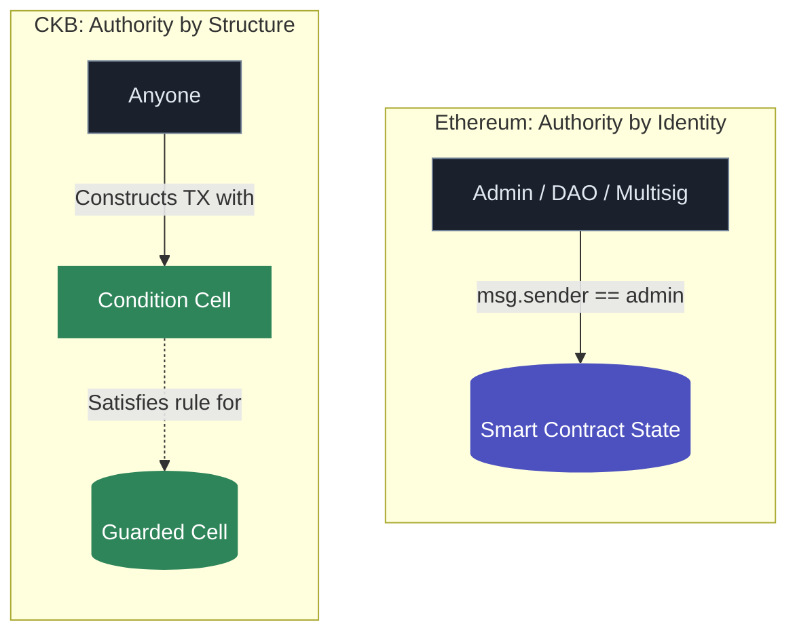
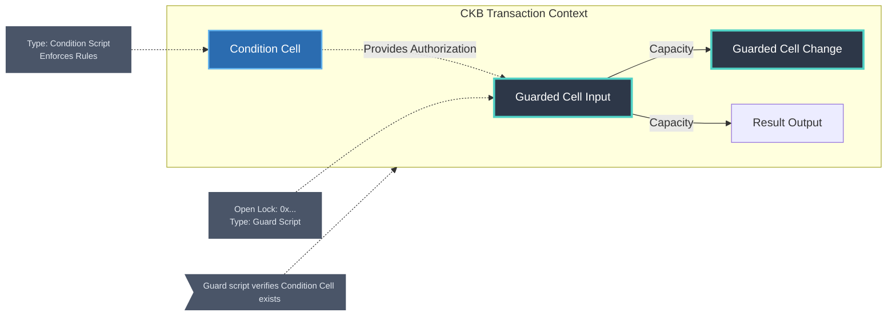
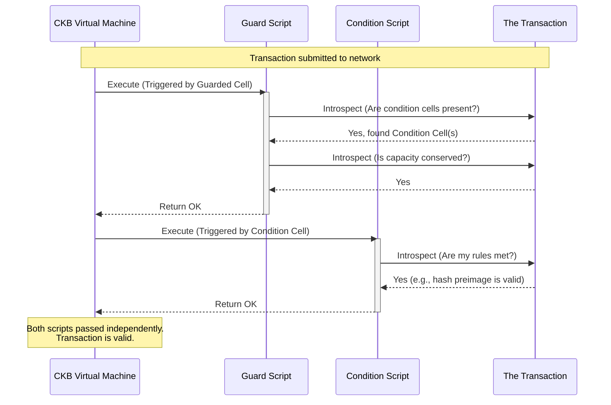

# CKB Structural Authorization

This repository defines the **Structural Authorization Pattern** for the Nervos CKB blockchain, along with its flagship application: the **Self-Enforcing Treasury**.

At its core, this project demonstrates how to build autonomous economic coordination without custodians. Unlike Ethereum smart contracts which often rely on admin keys or governance multisigs, this pattern leverages CKB's unique cell model and transaction introspection to create systems where **capacity moves by condition, not by key**. Once the rules are deployed, they are the sole authority.

## Structural Authorization vs Treasury

These are two different layers — not two names for the same thing.

**Structural Authorization** ([`SPEC-CORE.md`](./SPEC-CORE.md)) is the pattern: a guarded cell whose type script permits spending only when a valid condition cell of an authorized type appears in the same transaction. No signature. No key. Most applications use this layer only — bug bounties, bonds, escrows, assurance contracts, bridge escrows, and the examples in [`POSSIBILITIES.md`](./POSSIBILITIES.md) are all structural authorization.

**Self-Enforcing Treasury** ([`SPEC-TREASURY.md`](./SPEC-TREASURY.md)) is an adaptation of that pattern for a specific problem: a **shared, donatable pool** where capacity is temporarily allocated via proof cells and replenished after use. It adds donation, anchor/execute/abort lifecycle, and replenishment on top of SPEC-CORE. Governance proposal funding (CKB Transaction Firewall) is the flagship example.

```
SPEC-CORE (the pattern)
  ├── Bug bounty, bonds, escrows, assurance pools, …   ← SPEC-CORE only
  └── SPEC-TREASURY (shared-pool adaptation)
        └── Governance treasury, milestone dev funds, …  ← SPEC-CORE + treasury lifecycle
```

If your application does not need a shared pool with temporary claims and capacity return, you do not need SPEC-TREASURY.

## Documentation & Specifications

The project is structured into core specifications, applied patterns, and conceptual documentation:

### Specifications
* [**SPEC-CORE.md**](./SPEC-CORE.md) - The base Structural Authorization Pattern. Specifies the pure mechanism of a guarded cell whose type script permits spending only when a valid condition cell of an authorized type appears in the same transaction.
* [**SPEC-TREASURY.md**](./SPEC-TREASURY.md) - The Shared Pool Pattern. Specifies the treasury application built on the core pattern, defining the donation mechanism, the anchor/execute/abort lifecycle, and capacity replenishment.

### Applications & Vision
* [**POSSIBILITIES.md**](./POSSIBILITIES.md) - A detailed catalog of what the structural authorization pattern enables, from near-term buildable applications (dominant assurance contracts, bug bounties) to complex theoretical architectures (trustless bridge escrows).

### Conceptual Origins
* [**structural-authorization-ckb.md**](./structural-authorization-ckb.md) - The original essay describing the problem of governance funding on CKB and the insight that led to the pattern.
* [**structural-authorization-ckb-comments.md**](./structural-authorization-ckb-comments.md) - Research notes, peer feedback, and discussion on the original pattern design.

## The Core Concept

A CKB cell with an open lock whose type script permits spending only when a valid cell of a specific authorized type appears in the same transaction.

By decoupling the *authority to spend* (which becomes an open, zero-auth lock) from the *conditions of spending* (enforced by the type script validating a transaction's structure), we can build true self-enforcing protocols on CKB.

## Visualizing the Pattern

### 1. The Paradigm Shift: EVM vs CKB

Ethereum smart contracts rely on *identity* (who is asking?). The Structural Authorization pattern relies on *structure* (does the transaction satisfy the rules?).



### 2. The Core Mechanism

The Guarded Cell has no key lock. Its movement is strictly gated by the presence of a valid Condition Cell in the same transaction.



### 3. Mutual Validation

The CKB VM runs both scripts independently against the same shared transaction context. There are no inter-contract calls.


