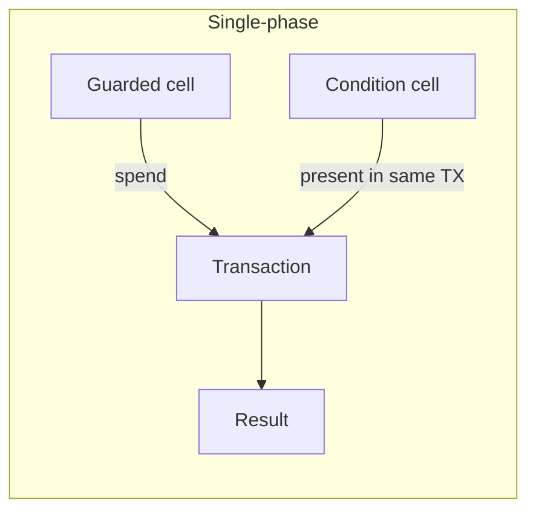
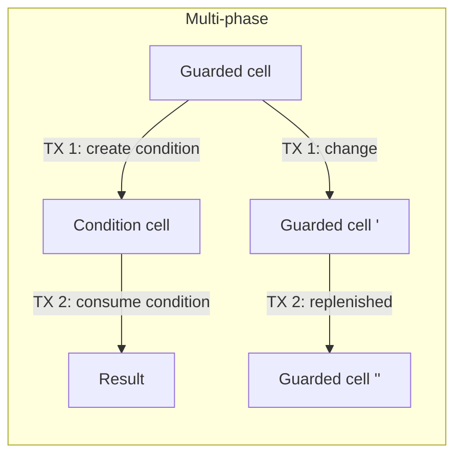

# SPEC-CORE: Structural Authorization Pattern

Status: **Draft**  
Version: **0.2.0**  
Related: [`structural-authorization-ckb.md`](./structural-authorization-ckb.md), [`SPEC-TREASURY.md`](./SPEC-TREASURY.md)

This document specifies the **core pattern** only: a CKB cell whose type script permits spending when — and only when — a valid cell of an authorized type appears in the same transaction. No signature. No key. The condition is the authorization.

This is a pattern — a reusable composition of CKB's primitives (cells, type scripts, transaction introspection, `since`, capacity model) — not a primitive itself. Most applications use this pattern directly (bounties, bonds, escrows, assurance contracts, …). One notable adaptation — a shared, donatable pool with temporary claims and replenishment — is specified in [`SPEC-TREASURY.md`](./SPEC-TREASURY.md).

---

## 1. Scope

### 1.1 In scope

- Roles: guarded cell, condition cell
- Authorization mechanism (structural, not key-based)
- Script responsibilities and mutual validation
- Capacity accounting invariants
- CKB deployment model (code hash + args)
- Security properties and threat model

### 1.2 Out of scope

- Application-specific condition logic (see application specs)
- Lifecycle patterns (single-phase vs multi-phase, see `SPEC-TREASURY.md` or application specs)
- Concrete cell data layouts
- Frontend / mempool coordination

---

## 2. Terminology

| Term | Definition |
|------|------------|
| **Capacity** | CKB stored in a cell (`capacity` field), denominated in shannons (1 CKB = 10⁸ shannons). |
| **Guarded cell** | A live cell whose type script is the guard script. Holds capacity that can only move when a valid condition is met. |
| **Condition cell** | A cell whose type script is an authorized condition script. Its presence in a transaction is what authorizes spending the guarded cell. |
| **Authorized condition type** | The condition type script hash that a given guard instance will accept. Fixed in guard `args`. |
| **Guard script** | The type script on guarded cells. Checks for authorized condition cells and enforces capacity conservation. |
| **Condition script** | The type script on condition cells. Enforces whatever application rules govern creation and consumption of conditions. |

---

## 3. The Mechanism

### 3.1 One sentence

A CKB cell with an open lock whose type script permits spending only when a valid cell of a specific authorized type appears in the same transaction.

### 3.2 Authorization model

Authorization is **structural**, not key-based:

- No private key can spend the guarded cell directly.
- A spend is permitted only when the transaction contains a valid condition cell of the authorized type.
- The condition script enforces application rules (signatures, payloads, thresholds, time gates, preimages, etc.).
- Both scripts evaluate the **same transaction** in the same consensus pass. Neither calls the other. This is a property of CKB's execution model: all type scripts on all inputs and outputs of a transaction run independently against the same transaction context.

### 3.3 Single-phase and multi-phase

The core mechanism does not prescribe a lifecycle. How the condition cell relates to the guarded cell's spend depends on the application:

| Mode | Description | Example |
|------|-------------|---------|
| **Single-phase** | Condition cell is created and/or consumed in the same TX that spends the guarded cell | Bounty: present hash preimage, claim funds — one TX |
| **Multi-phase** | Condition cell is created in one TX (funded from the guarded cell), then consumed in a later TX after some delay or event | Governance: create proposal, wait 72h, execute — two TXs |

The guard script does not distinguish these. It checks: "is there a valid condition cell of authorized type in this transaction?" The condition script and the application determine whether the condition cell persists between transactions.





---

## 4. Core Invariants

All compliant implementations MUST satisfy these invariants.

### 4.1 Safety

| ID | Invariant |
|----|-----------|
| **INV-S1** | A guarded cell input may appear only in transactions containing at least one valid condition cell of the authorized type. |
| **INV-S2** | Every condition cell accepted by the guard MUST have a type script whose hash equals the guard's `authorized_condition_script_hash` (see §6.1). |
| **INV-S3** | No lock script signature is required for guard authorization. Guard witness MUST be empty (`0x`). |
| **INV-S4** | Adversarial cells that mimic condition layout but use wrong `code_hash`, `hash_type`, or `args` MUST be rejected. |
| **INV-S5** | Condition cells validated by the guard MUST also pass their own type script (guaranteed by CKB consensus — all type scripts run). |

### 4.2 Accounting

| ID | Invariant |
|----|-----------|
| **INV-A1** | For every transaction: `Σ(input.capacity) = Σ(output.capacity) + fee`. |
| **INV-A2** | The guard script MUST verify capacity conservation: the guarded cell's capacity is accounted for across outputs (condition cells, change outputs, result outputs). The specific conservation rule is defined by the application but MUST NOT allow silent capacity drain. |
| **INV-A3** | Guarded cell outputs MUST meet minimum CKB occupancy for their byte size. |

### 4.3 Liveness

| ID | Property |
|----|----------|
| **INV-L1** | Anyone may submit a valid transaction that spends a guarded cell (no privileged relayer). |
| **INV-L2** | Anyone may send capacity to the guarded cell's address without guard script execution (plain transfer to a new cell at the same lock + type address). |

---

## 5. Script Interface

### 5.1 Guard type script

**Deployment:** One guard script binary referenced by `code_hash`. Per-instance parameters in `args`.

**Args layout (core, 32 bytes minimum):**

```
| offset | size | field                             |
|--------|------|-----------------------------------|
| 0      | 32   | authorized_condition_script_hash  |
```

Applications MAY extend args with additional fields (version byte, capacity limits, etc.).

**`authorized_condition_script_hash`:** Blake2b hash of the full `Script` struct (code_hash + hash_type + args) for the condition type. This pins the exact condition script including its `args`, preventing cross-application confusion. For upgradeable deployments, using the Type ID hash is a permitted variant, but the default MUST be the full Script struct hash.

**Guard lock script:** MUST be an open lock (`always_success`) or equivalent zero-auth lock. The type script is the sole gatekeeper. A lock requiring a signature (like standard secp256k1) violates the structural authorization premise and is NOT permitted.

**Guard script behavior:**

When the guard script runs (guarded cell appears as input or output in a transaction), it:

1. Scans the transaction for condition cells matching `authorized_condition_script_hash`.
2. Verifies at least one valid condition cell is present (as input, output, or both — depending on application).
3. Verifies capacity conservation (application-defined rule, but drain MUST NOT occur).

When a guarded cell appears **only as an output** (creation / donation), the guard script SHOULD permit creation without condition-cell presence — this enables donations and initial seeding. Applications MAY restrict creation further.

### 5.2 Condition type script (plug-in interface)

Each application deploys a condition script binary. The guard binds to one condition script hash via `args`.

**Condition script responsibilities:**

| Context | When | Responsibility |
|---------|------|----------------|
| **Creation** | Condition cell appears in outputs | Validate data, capacity, references, creation rules |
| **Consumption** | Condition cell appears in inputs | Validate success/abort conditions, result outputs, witnesses |

**Condition script MUST NOT:**

- Assume it is called by the guard script.
- Trust return values from other scripts.
- Rely on transaction input ordering beyond what it verifies itself.

**Condition `args`:** Application-defined. Typical fields: protocol version, committee keys hash, campaign ID, etc.

### 5.3 Identifying an authorized condition cell

A cell is a valid condition for guard purposes if and only if:

```
hash(cell.type_script) == guard.args.authorized_condition_script_hash
AND cell.type_script.code_hash resolves to deployed condition binary (via cell_deps)
AND condition script passes for this cell
```

Comparison MUST use the full script hash, not data layout alone (INV-S4).

### 5.4 Mode detection

The guard script infers context from the transaction structure:

- **Guarded cell in inputs, condition cell in outputs:** A condition is being created, funded from the guarded cell (multi-phase start, or single-phase where condition is created for immediate use).
- **Guarded cell in inputs, condition cell in inputs:** A condition is being fulfilled / consumed (multi-phase end, or single-phase where condition is consumed).
- **Both:** Condition cell in both inputs and outputs (rotation, batch operations, or single-phase with creation + consumption).
- **Guarded cell in outputs only (no guarded input):** Donation / creation. Guard script SHOULD permit without condition.

The guard script does not need to distinguish these rigidly. The minimum requirement is: **if a guarded cell is being consumed (appears as input), at least one valid condition cell must be present in the transaction.**

---

## 6. CKB Deployment Model

### 6.1 Template pattern

| Layer | Fixed | Per-instance |
|-------|-------|--------------|
| Script binary | `code_hash` | — |
| Guard instance | guard `code_hash` | `args { authorized_condition_script_hash, … }` |
| Condition instance | condition `code_hash` | `args { application params }` |
| Cell state | — | `data` field per application schema |

### 6.2 Immutable vs upgradeable

| `hash_type` | Use case |
|-------------|----------|
| `data` / `data1` | Immutable guard/condition (recommended for production after audit) |
| `type` + Type ID | Upgradeable; requires trust in Type ID cell lock holder |

**Recommendation:** Deploy on testnet with Type ID; freeze to `data` hash before mainnet funds.

### 6.3 Deployment sequence

1. Deploy condition script binary (cell with data).
2. Compute `authorized_condition_script_hash`.
3. Deploy guard script binary.
4. Create initial guarded cell with `args` referencing step 2 (seed capacity).
5. Publish address (lock + type) for donations / interaction.

---

## 7. Security Properties

### 7.1 Guaranteed (if spec implemented correctly)

| Property | Description |
|----------|-------------|
| **No key path** | No signature unlocks guarded capacity. |
| **Condition-only spend** | Guarded cell moves only with authorized condition cell in the same TX. |
| **Atomic mutual validation** | Condition and guard scripts evaluated in one consensus context. This is a CKB execution model property that the pattern relies on — not something the pattern itself provides. |
| **No reentrancy** | No inter-script calls; no reentrancy surface. This is inherent to CKB's execution model. |

### 7.2 Threat model

| Threat | Mitigation |
|--------|------------|
| Output injection (fake condition) | Full script hash check (INV-S4); condition cell validation |
| Condition script bug | Pre-audit, formal spec, testnet soak; immutability after deploy |
| Capacity drain via valid conditions | Application-level rate limits, minimum capacity rules, creation bonds |
| Stranded capacity (condition with no valid spend path) | Application MUST define recovery/abort mechanisms for multi-phase patterns |
| Type confusion across deployments | `authorized_condition_script_hash` binding |
| Griefing (spam conditions) | Economic cost of fees + optional creation barriers in condition script |

### 7.3 Trust boundaries

| Trusted at inception | Trustless in operation |
|---------------------|------------------------|
| Deployer chooses condition rules | No committee to move funds |
| Script bytecode (if immutable) | No ongoing admin keys |
| Initial seed capacity | Capacity additions are voluntary |

### 7.4 Design philosophy

**The permanence of bugs:** The pattern is intentionally non-upgradeable by default (via `hash_type: data`). This is a feature, not a limitation. The "no one controls it" property becomes a liability if there is a logic error, but any post-deployment recovery mechanism reintroduces a trusted party. The response is a higher pre-deployment diligence bar:

- Formal specification of condition rules before implementation
- Comprehensive negative test coverage (see §8)
- Extended testnet soak (recommended: minimum 30 days with adversarial testing)
- Independent audit for any deployment holding significant value

**UTXO contention:** If the guarded cell is a singleton (common for pool-style applications), operations are strictly sequential. Two users cannot spend the same guarded cell in the same block. Applications MUST account for this. Throughput ceiling: **~1 operation per CKB block (~10s)**. Applications needing higher throughput should consider multiple guarded cells with merge/split rules.

---

## 8. Test Requirements

### 8.1 Must-pass (positive)

| ID | Test |
|----|------|
| **T+01** | Valid spend with authorized condition cell present |
| **T+02** | Capacity conservation holds across spend |
| **T+03** | Empty witness on guarded cell input |
| **T+04** | Donation (new guarded cell created) succeeds without condition cell |
| **T+05** | Condition cell in outputs (creation context) — guard permits |
| **T+06** | Condition cell in inputs (consumption context) — guard permits |

### 8.2 Must-reject (negative)

| ID | Test |
|----|------|
| **T-01** | Spend without any condition cell |
| **T-02** | Spend with condition cell of wrong `code_hash` |
| **T-03** | Spend with condition cell of correct code but wrong `args` |
| **T-04** | Spend violating capacity conservation |
| **T-05** | Spend with signature witness instead of empty (no proof) |
| **T-06** | Condition cell from foreign deployment (wrong full script hash) |
| **T-07** | Adversarial output mimicking condition layout but wrong type |

### 8.3 Property tests

- Randomized output injection during guarded cell spends
- Capacity sum invariant after every TX (INV-A1)
- Fuzz condition cell `data` near boundary lengths

---

## 9. References

- Pattern overview: [`structural-authorization-ckb.md`](./structural-authorization-ckb.md)
- Discussion / prior art: [`structural-authorization-ckb-comments.md`](./structural-authorization-ckb-comments.md)
- Treasury application: [`SPEC-TREASURY.md`](./SPEC-TREASURY.md)
- CKB Type ID: https://docs.nervos.org/docs/script/type-id
- CKB Script intro: https://docs.nervos.org/docs/script/intro-to-script
- CKB `since` / transaction structure: https://docs.nervos.org/docs/tech-explanation/since
- Live implementation (governance): https://github.com/digitaldrreamer/ckb-transaction-firewall
- UTXO output injection: arXiv:2406.07700

---

## Appendix A: Pseudocode (guard script)

```
fn guard_main():
    authorized = load_args().authorized_condition_script_hash

    if guarded_cell_in_inputs():
        // Guarded cell is being spent — require authorization
        condition_cells = find_condition_cells(authorized)   // in inputs, outputs, or both
        assert len(condition_cells) >= 1
        assert capacity_conserved()
        assert witness_is_empty()
    else:
        // Guarded cell appears only in outputs — creation / donation
        // Permit by default (application MAY add creation restrictions)
        return OK
```

## Appendix B: Pseudocode (condition script interface)

```
fn condition_main():
    if condition_in_outputs() && !condition_in_inputs():
        return on_create()       // validate creation rules
    if condition_in_inputs() && !condition_in_outputs():
        return on_consume()      // validate fulfillment / abort
    if condition_in_inputs() && condition_in_outputs():
        return on_update()       // validate rotation / update (if supported)
    return ERR
```

Application specs implement `on_create`, `on_consume`, and optionally `on_update`.
