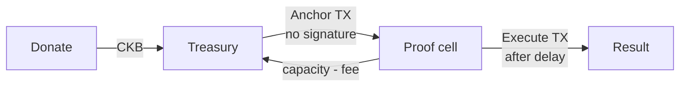
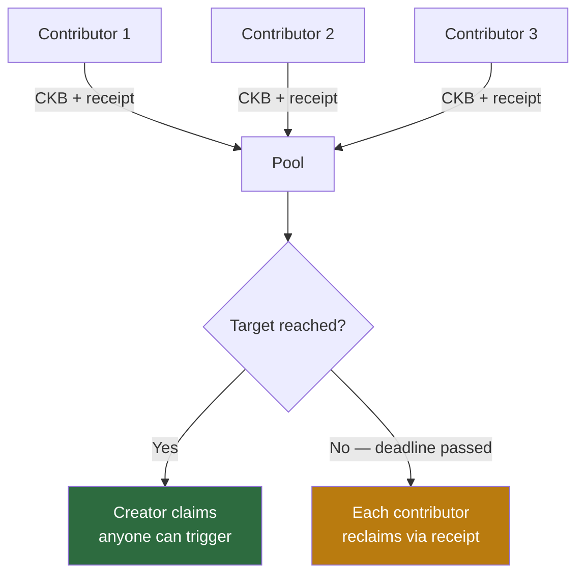

# The Self-Enforcing Treasury: A New Financial Pattern on CKB

There is a class of financial coordination problem that always comes back to the same wall: someone has to hold the keys.

Multisig helps. DAOs help. But at the end of the chain there is always a person — or a committee — whose cooperation you need to move money. Governance stalls. Keys get lost. Committees get captured. The whole thing devolves into "trust us, we're the committee."

I stumbled onto a different approach while building a governance system on CKB. I want to document it because it's more general than the thing I built it for — and because CKB makes it possible in a way that other chains don't.

## The problem that forced the insight

CKB's storage model is explicit about costs. Every on-chain cell must hold capacity proportional to its byte size — typically 61 CKB or more just to exist. That capacity is locked for the life of the cell. When the cell is deleted, you get it back.

This is good design. It prevents state bloat by making storage economically bounded. But it creates a participation tax for any system that needs to create and rotate on-chain state regularly.

In my governance system, every proposal required creating an anchor cell on-chain. Someone had to front that capacity. If that someone was the proposer, I was asking governance participants to lock personal capital indefinitely for the public good. That's not a governance system. That's a donor programme with extra steps.

The question I kept coming back to was: whose money should this be, and why does it have to be anyone's in particular?

---

## The insight

Instead of asking *who controls the funds*, ask *under what conditions should capacity be allowed to move*.

CKB type scripts are arbitrary programs that run every time a cell they govern appears in a transaction. A type script on a pool cell can inspect the entire transaction context — what inputs are present, what their type scripts say, what their data contains. You can write a rule: "this capacity may only leave if a specific kind of proof cell also appears in this transaction." No signature. No key. The condition is the authorization.

This is the self-enforcing treasury pattern:

```
Treasury cell   →   only spendable when a proof cell appears in the same TX
Proof cell      →   governed by its own type script that enforces the real conditions
```

No one controls the treasury. Anyone can trigger a valid spend. No one can trigger an invalid one.

---

## The pattern

Three components, two transactions.

**Treasury cells** hold the pool. They are plain CKB cells locked by the treasury type script. Anyone can donate by sending capacity to the treasury address. The address encodes which proof type is authorised — nothing else.

**Proof cells** are the on-chain claims. Creating one requires satisfying whatever conditions the proof type script enforces: a valid payload, the right target, minimum capacity. The proof cell is the key.

**The time constraint** lives in CKB's native `since` field on transaction inputs. Setting it to a relative median-time-past (MTP) value means the transaction cannot be included by miners until that duration of real time has elapsed — enforced by every node independently, with no oracle, no contract-level timestamp check, no manipulation window.

The two transactions are simple:

```
Anchor TX (create proof):
  inputs:  [ treasury_cell ]          ← treasury type script runs, checks outputs
  outputs: [ proof_cell, treasury_change ]
  witnesses: [ "0x" ]                 ← no signature

Execute TX (consume proof, after delay):
  inputs:  [ proof_cell (since: Nh MTP), ... ]
  outputs: [ result_cell, treasury_change ]
```

In the anchor TX, the treasury type script scans the outputs looking for a valid proof cell. If it finds one, the spend is permitted. If not, rejected.

In the execute TX, the treasury type script scans the inputs looking for a proof cell being consumed. Once a valid proof cell appears as an input, the treasury knows the proof type script already validated all the conditions — because both scripts run against the same transaction in the same consensus evaluation. There is no inter-contract call, no return value to trust, no ordering dependency. Mutual validation in one atomic context.

Capacity that leaves the treasury for the proof cell returns when the proof is consumed. The system replenishes itself on every cycle, net of transaction fees.



---

## Why CKB specifically

Three properties of CKB combine to make this clean. On other chains, you get one or two but not all three together.

The closest analogue is Ergo. Ergo's box model and ErgoScript allow scripts to inspect the full spending transaction — inputs, outputs, data fields — which is the same property that makes the treasury/proof mutual-validation work. Ergo's ZK Treasury (deployed 2020) lets groups authorize spending without a single controlling key, using composable sigma protocols. It is the right comparison and worth being precise about the gap: Ergo's sigma-protocol authorization still requires a cryptographically generated human artifact as a witness. The CKB pattern requires none — the proof cell is the authorization, not evidence that someone signed off on it. The other gap is property one below: Ergo has no explicit recoverable storage costs. The self-replenishing loop does not follow from Ergo's economic model the way it follows from CKB's.

**Recoverable storage costs.** Capacity flows out when state is created and back when it is deleted. The treasury replenishment on every cycle is not a clever trick — it is what the model naturally produces. On Ethereum, storage costs gas on write but there is no native concept of value that flows back when state is deleted.

**Type scripts as transaction-level spending conditions.** A type script on the treasury cell can inspect the full transaction without calling into another contract. Both the treasury script and the proof script run against the same transaction simultaneously — each independently validates the structure, and CKB consensus requires all of them to pass. This is what eliminates reentrancy risk and inter-contract trust.

**Consensus-enforced time constraints.** The `since` field is part of the CKB transaction wire format, not a smart contract feature. Miners physically cannot include a transaction whose `since` constraint has not been met. The delay is enforced at inclusion, not at application logic. Bitcoin has `nSequence` which is similar in principle, but Bitcoin's scripts cannot read cell data to construct dynamic spending conditions. Cardano's validity intervals are the closest equivalent, but Cardano's execution model requires every UTxO to be pre-declared, making the mutual-reference pattern between treasury and proof cells more cumbersome to wire up.

---

## It works — the governance treasury

I deployed this in the CKB Transaction Firewall, a governance system for an on-chain blacklist registry. The treasury funds proposal anchor cells. Validators vote. After a 72-hour review window enforced by the `since` field, a threshold of validator signatures authorises execution. The anchor cell is consumed, the new registry cell is created, and the anchor capacity flows back to the treasury.

The treasury has been running on CKB testnet since May 2026. Each governance cycle costs approximately 1 CKB in transaction fees. Everything else returns.

The important property: no one needed to manage the treasury. No one was designated to pay for anchors. Anyone could create a proposal and the treasury funded it — as long as the proposal was valid.

---

## The general form

The treasury type script and proof type script are independently parameterisable. Change the proof type and you get a different application. The treasury itself stays almost unchanged.

| Application | Proof conditions | Time constraint |
|---|---|---|
| Governance treasury | Valid proposal payload + committee signatures | Review window |
| Crowdfund | Contribution receipts + target amount | Refund deadline |
| Vesting | Beneficiary identity + cycle index | Cliff and intervals |
| Bounty | Hash preimage | Optional deadline |
| Recurring salary | Payroll cycle cell | Period duration |
| Savings vault | Owner key + balance target | Maturity date |

The pattern is: describe the conditions precisely, write them into a type script, and let the network enforce them.

---

## Building it: a trustless crowdfund

A crowdfund with automatic refund is the clearest demonstration. The creator sets a target and a deadline. Contributions accumulate in a pool. If the target is reached, the creator claims — and anyone can trigger this, not just the creator. If the deadline passes without reaching the target, every contributor can reclaim their own funds individually. The creator has no special access at any stage.

This is three new type scripts: the pool, the contribution receipt, and the time-gated claim.

### Pool cell

```
version(1) | creator_pubkey_hash(20) | target_shannons(8 LE) | deadline_ms(8 LE) | accumulated_shannons(8 LE)
```

The pool type script enforces two spending modes:

**Successful claim** — `accumulated_shannons ≥ target_shannons`, funds go to `creator_pubkey_hash`. Anyone can submit this transaction — the creator's lock address is readable from the pool cell data on-chain, so no cooperation from the creator is required to construct the output.

**Refund** — `since` field encodes time past `deadline_ms` (relative MTP, seconds on the wire multiplied by 1000 to compare against the millisecond deadline), contributor's receipt cell consumed in the same transaction, exactly `contributed_shannons` returns to the contributor.

### Receipt cell

```
version(1) | pool_type_id(32) | contributor_pubkey_hash(20) | contributed_shannons(8 LE)
```

Created when someone contributes. Consumed when they claim a refund. Binds the contribution to a specific pool so receipts from one campaign cannot be used to claim from another.

One property of CKB's UTXO model worth noting: because `accumulated_shannons` is a mutable field in the pool cell, every contribution consumes the pool cell and recreates it. Contributions are therefore sequential — two contributors cannot contribute in the same block. This is a meaningful constraint for campaigns that receive concurrent interest. A frontend must serialize contributions, and under load, contributors will experience queuing delays. It is not a fundamental limitation of the pattern but it is a real implementation cost that a crowdfunding UX must address explicitly, not paper over.

### The transaction structure

```
Contribute:
  inputs:  [ contributor_wallet_cell ]
  outputs: [ pool_cell (updated), receipt_cell, contributor_change ]

Claim (success):
  inputs:  [ pool_cell ]
  outputs: [ creator_wallet_cell ]

Refund (deadline passed):
  inputs:  [ pool_cell (since: past deadline), receipt_cell ]
  outputs: [ pool_cell (updated), contributor_wallet_cell ]
```



### What this changes

On any existing crowdfund platform, the platform holds the money and enforces the rules. The rules are contractual, not technical. In this system the type scripts are the platform — enforced by every CKB node independently, with no company to lobby, no terms of service to dispute, and no platform fee beyond the CKB transaction fee.

The creator cannot take funds before the target is met. The contract rejects the transaction. A contributor cannot block a successful claim. The contract permits it regardless. These are not policies. They are the consensus rules of the chain.

---

## What this unlocks

The self-enforcing treasury is a pattern built on CKB's primitives — type scripts, cells, the `since` field. The pattern is what is new, not the underlying tools. The governance system that produced it uses it to fund proposals without a privileged payer. The crowdfund uses it to hold pooled contributions without a privileged custodian. The mechanics are the same.

The underlying reason goes back to the cell model. On CKB, "holding value in a contract" and "paying for on-chain storage" are the same operation. Capacity is not a metaphor for value — it is value, and it flows back when storage is released. This means the economic incentives and the technical rules are expressed in the same terms. There is no separate incentive layer that needs to be kept in sync with the protocol. The protocol is the incentive layer.

That property is what makes the conditions you write into type scripts so powerful. Within the real constraints — sequential UTXO contention under concurrent load, script execution costs, the permanence of bugs in deployed type scripts — the ceiling on what you can build is set less by what the VM can do than by how precisely you can describe the conditions under which capacity should move.

---

*The CKB Transaction Firewall — the governance system that produced the treasury pattern — is at [github.com/digitaldrreamer/ckb-transaction-firewall](https://github.com/digitaldrreamer/ckb-transaction-firewall). The crowdfund implementation is in progress.*

